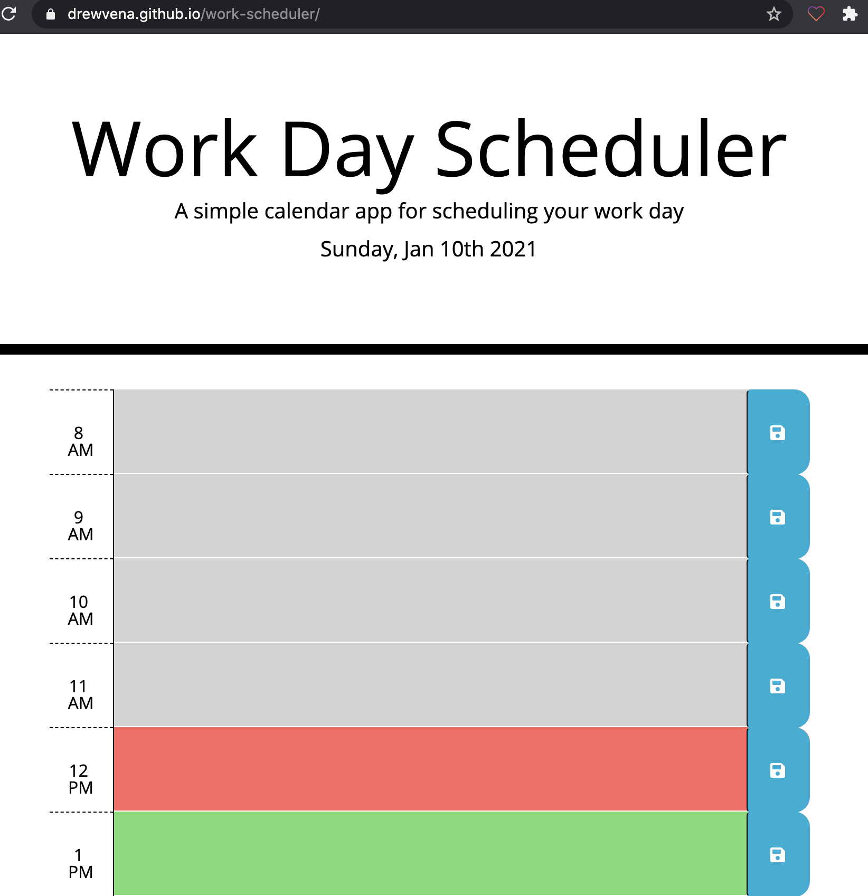

# work-scheduler
Here is my work scheduler using Jquery, Bootstrap and Moment.js! The application has an ability to both save and edit features and also has past, present, and future time blocks!
Deployed application can be found at https://drewvena.github.io/work-scheduler/
